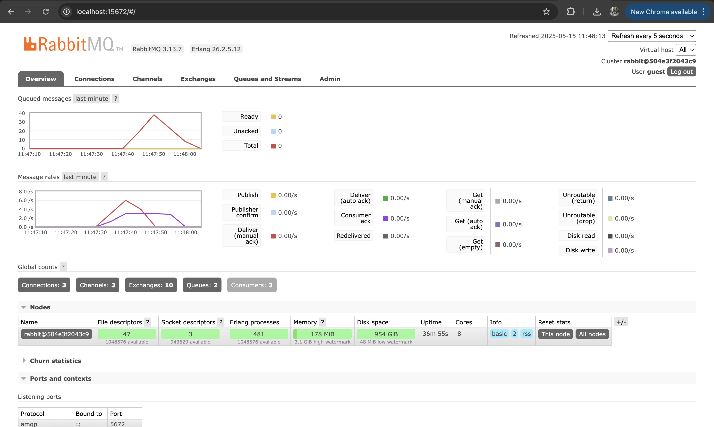

# Advanced Programming Module 9 - Subscriber
### Athazahra Nabila Ruby - 2306173113

> What is `amqp`?
 
AMQP (Advanced Message Queuing Protocol) is a network communication protocol like HTTP/HTTPS that is used for sending messages between applications or services. AMQP allows systems to communicate with each other by sending data over the internet as a stream of bytes.

AMQP supports both point-to-point message delivery and the publisher-subscriber model. In the publisher-subscriber model, one system (the publisher) sends messages that are then forwarded to one or more other systems (subscribers) via a queue. In this tutorial, AMQP is implemented using the crosstown_bus library so that UserCreatedHandler can receive messages sent to the user_created queue.

> What does it mean `guest:guest@localhost:5672` , what is the first guest, and what is the second guest, and what is `localhost:5672` is for?
 
The URI guest:guest@localhost:5672 is used to connect to the AMQP server by including authentication information and the destination address.

- guest (before :) = the username, which is the identity used to log in to the server.
- guest (after :) = the password corresponding to the username. In this URI, it is the same because both username and password use the default value guest.
- localhost = indicates the connection is made to the local machine.
- 5672 = the default port used by the AMQP server.

This URI indicates that the client will establish a connection to a server running on the local machine through port 5672, using the default guest as both the username and password.

> Simulation slow
 

In my machine, the number of visible queues is 2, which indicates that only two queues were created and used during the program's execution. It also shows that there are 24 unacked messages, meaning these messages are still waiting to be processed by the subscriber. This likely happened because in the implementation, the subscriber introduces a 1-second delay (thread::sleep) when processing each message. As a result, when the publisher sends messages quickly, the queue becomes backed up because the subscriber consumes messages much more slowly, leading to a high number of pending messages even though there are still only two queues.

> Running Three Subscribers
 

On my machine, 3 subscribers were run simultaneously, and the system shows that only two queues were created. The messages were evenly distributed and processed quickly, resulting in no unacknowledged messages and no buildup in the message queues. The spike in the message rate chart corresponds to when the publisher was run several times, and each subscriber successfully printed messages such as "Dira", "Emir", and "Cica" in parallel. The result demonstrates an event-driven structure where the publisher does not care who the receivers are, and the resulting behavior can change depending on how many subscribers are active.git

## Bonus
I ran the experiment on Azure, using the public ip 20.2.65.83 and an admin account for RabbitMQ that was set in the virtual machine.
> Simulation slow
 

The result is similar to before. The number of visible queues is still 2, indicating that 2 queues were created and used in this enviroment. The chart now shows that there are 20 unacked messages, which is different from before but it is likely because I took a screenshot at a different time period. These unacked messages happened because there is a 1-second delay in the implementation, leading to a backed-up queue and a high number of pending messages.